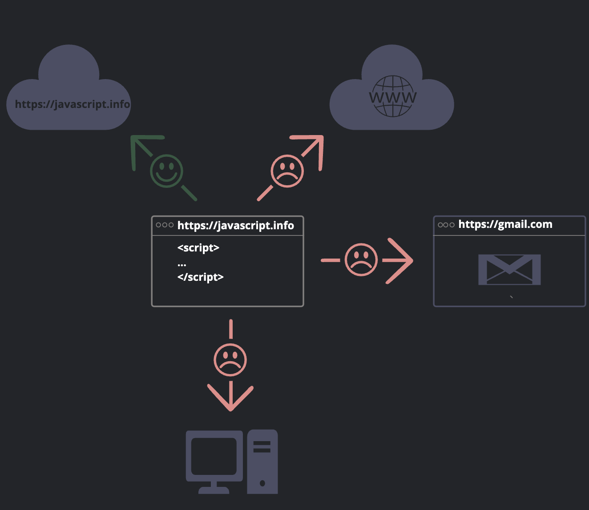

# 자바스크립트란?
## 정의
* 자바스크림트는 '웹페이지에 생동감을 불어넣기 위해' 만들어진 프로그래밍 언어
* 자바스크립트로 작성한 프로그램을 스크립트(script)라고 부름
* 스크립트는 웹페이지의 HTML 안에 작성할 수 있고, 웹페이지를 불러올 때 스크립트가 자동으로 실행됨
* 스크립트는 특별한 준비나 컴파일 없이 보통의 문자 형태로 작성/실행할 수 있음
            
* 자바스크립트는 브라우저뿐만 아니라 서버에서도 실행될 수 있고, 자바스크립트 엔진이 들어 있는 모든 디바이스에서도 동작함
## 브라우저에서 할 수 있는 일
* 페이지에 새로운 TML을 추가하거나 기존 HTML, 혹은 스타일 수정
* 마우스 클릭이나 포인터의 움직임, 키보드 키 눌림 등과 같은 사용자 행동에 반응하기
* 네트워크를 통해 원격 서버에 요청을 보내거나, 파일 다운로드, 업로드    
(AJAX나 COMET과 같은 기술 사용)
* 쿠키를 가져오거나 설정하기. 사용자에게 질문을 거네거나 메시지 보여주기
* 클라이언트 측에 데이터 저장하기 (로컬 스토리지)
## 브라우저에서 할 수 없는 일
* 웹 페이지 내 스크립트는 디스크에 저장됨 임의의 파일을 읽거나 쓰고, 복사하거나 실행할 때 제약을 받을 수 있다. 운영체제가 지원하는 기능을 브라우저가 직접 쓰지 못하게 막혀 있기 때문
    * 모던 브라우저를 사용하면 파일을 다룰 순 있지만 접근은 제한되어 있다. 사용자가 브라우저 창에 파일을 '끌어다 두거나' ```<input>``` 태그를 통해 파일을 선택하는 등 특정 상황에서만 파일 접근이 허용된다.
    * 카메라나 마이크 같은 디바이스와 상호 작용하려면 사용자의 명시적 허가가 있어야 한다.
* 브라우저 내 탭과 창은 대개 서로의 정보를 알 수 없다. 다만 자바스크립트를 사용해 한 창에서 다른 창을 열 때는 예외가 적용된다. 하지만 이 경우에도 도메인이나 프로토콜, 포트가 다르다면 페이지에 접근할 수 없다.
    * 위와 같은 제약사항을 '동일 출처 정책(Same Origin Policy)'이라 부른다. 이 정책을 피하려면 두 페이지는 데이터 교환에 동의해야 하고, 동의와 관련된 특수한 자바스크립트 코드를 포함하고 있어야 한다.
    * 이런 제약사항은 사용자의 보안을 위해 만들어졌다. 한 페이지가 다른 페이지에서 받아온 페이지 상의 정보에 접근해 중요한 개인정보를 훔치는 걸 막기 위함이다.
* 자바스크립트를 이용하면 페이지를 생성한 서버와 쉽게 정보를 주고받을 수 있다. 하지만 타 사이트나 도메인에서 데이터를 받아오는 건 불가능하다. 가능하다 할지라도 원격 서버에서 명확히 승인을 해줘야 한다(HTTP 헤더 등을 이용). 이 역시 보안을 위해 만들어진 제약사항이다.

## 자바스크립트 만의 강점
```
* HTML/CSS와 완전히 통합할 수 있음
* 간단한 일은 간단하게 처리할 수 있게 해줌
* 모든 주요 브라우저에서 지원하고, 기본 언어로 사용됨
```
## 자바스크립트 '너머의' 언어들
* 프로젝트마다 요구사항이 천차만별
* 이러한 요구를 충족하기 위해, 브라우저에서 실행 되기 전에 자바스크립트로 트랜스파일(transpile, 변환)할 수 있는 새로운 언어들이 많이 등장

* 자바스크립트로 트랜스파일이 가능한 언어 몇 가지
    * CoffeScript
        : 자바스크립트를 위한 'syntatic sugar'. 짧은 문법을 도입하여 명료하고 이해하기 쉬운 코드를 작성. Ruby 개발자들이 좋아함.
    * TypeScript
        : 개발을 단순화하고 복잡한 시스템을 지원하려는 목적으로 '자료형의 명시화(strict data typing)'에 집중해 만든 언어. Microsofy가 개발.
    * Flow
        : 자료형을 강제, TypeScript 와는 다른 방식 사용. Facebook이 개발.
    * Dart
        : 모바일 앱과 같이 브라우저가 아닌 환경에서 동작하는 고유의 엔진을 가진 독자적 언어. Google 이 개발.
## 요약
* 자바스크립트는 브라우저에서만 쓸 목적으로 고안된 언어이지만, 지금은 다양한 환경에서 쓰이고 있다.
* 오늘날 자바스크립트는 브라우저 환경에서 가장 널리 사용되는 언어로 자리매김하였다. HTML/CSS와 완전한 통합이 가능하다.
* 자바스크립트로 '트랜스파일'할 수 있는 언어는 많다. 각 언어마다 고유한 기능을 제공한다. 자바스크립트에 숙달한 뒤에 이 언어들을 살펴볼 것.