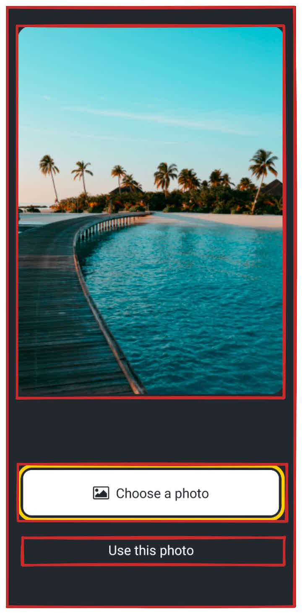
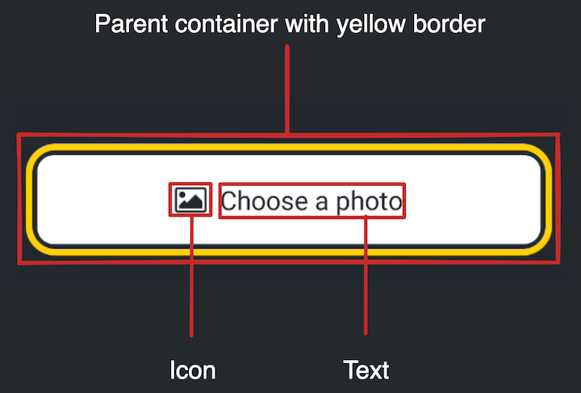

# 화면 만들기
## 1. 화면을 뜯어보자

* 이 화면에는 3가지 중요한 요소들이 있다.
    * 이 화면은 background color 가 있다.
    * 화면 중앙에 큰 사진이 하나 보여지고 있다.
    * 화면 절반 아래에 2개의 버튼이 있다.


* 첫 번째 버튼은 여러 개의 components로 구성되어 있다.
* 부모 요소가 노랑색 부분을 차지하는데 구 하위 요소로 아이콘과 text components 를 가진다.


* Reactive Native 에서는 styling을 할 때 JavaScript 를 이용
* 대부분의 Reactive Native core components 는 JavaScript의 object로 가지는 ```style``` prop 을 허용
## 2. backgorund 를 Style 해보자
``` javascript
import { StatusBar } from 'expo-status-bar';
import { StyleSheet, Text, View } from 'react-native';

export default function App() {
  return (
    <View style={styles.container}>
      <Text>Open up App.js to start working on your app!</Text>
      <StatusBar style="auto" />
    </View>
  );
}

const styles = StyleSheet.create({
  container: {
    flex: 1,
    // 이 부분을 수정, 색깔을 넣어줌
    backgroundColor: '#25292e',
    alignItems: 'center',
    justifyContent: 'center',
  },
});

```
* Reactive Native 은 웹과 같은 색깔 형식을 이용
* hex triplets (```#fff```), ```rgba```, ```hsl```, ```red```, ```green```, ```blue```, ```peru```, ```papayawhip``` 등등
## 글자색 바꾸기
``` javascript
import { StatusBar } from 'expo-status-bar';
import { StyleSheet, Text, View } from 'react-native';

export default function App() {
  return (
    <View style={styles.container}>
        {/* 이 부분을 수정. 해당 요소에 style 형태로, javascript 랑 비슷함 */}
      <Text style={{ color: '#fff' }}>
        Open up App.js to start working on your app!
      </Text>
      <StatusBar style="auto" />
    </View>
  );
}

const styles = StyleSheet.create({
  container: {
    flex: 1,
    backgroundColor: '#25292e',
    alignItems: 'center',
    justifyContent: 'center',
  },
});

```
## 4. 사진 보여주기
* Reactive Native 의 ```<Image>``` component를 이용해 앱에서 사진을 보여줄 수 있음
* ```<Image>``` component 는 사진의 source 가 필요함
* **./assets/images** 와 같은 asset 나 URL 형태일 수도 있음
``` javascript
import { StatusBar } from 'expo-status-bar';
import { StyleSheet, View, Image } from 'react-native';

const PlaceholderImage = require('./assets/images/background-image.png');

export default function App() {
  return (
    <View style={styles.container}>
      <View style={styles.imageContainer}>
        <Image source={PlaceholderImage} style={styles.image} />
      </View>
      <StatusBar style="auto" />
    </View>
  );
}

const styles = StyleSheet.create({
  container: {
    flex: 1,
    backgroundColor: '#25292e',
    alignItems: 'center',
  },
  imageContainer: {
    flex: 1,
    paddingTop: 58,
  },
  image: {
    width: 320,
    height: 440,
    borderRadius: 18,
  },
});

```
## 5. components 를 파일로 나누기
* 프로젝트의 최상단에 coponents 폴더를 만든다. 이 폴더에 이 프로젝트 과정에서 나오는 모든 components를 저잗ㅇ할 것이다.
* 그리고 components 폴더 내부에 **ImageViewer.js** 파일을 만든다.
* 이 파일에서 ``image`` styles 를 이용해 사진을 보여주도록 코드를 작성한다.