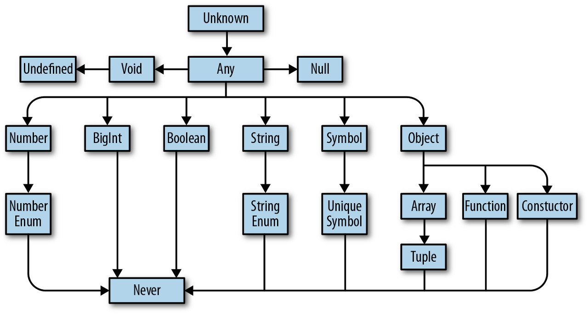

# 소개
* 본 문서는 '<타입스크립트 프로그래밍(보리스 체르니 저)>'를 참고하여 작성되었다.
<hr />

# 1장
```
**타입 안정성(type safety)
타입을 이용해 프로그램이 유효하지 않은 작업을 수행하지 않도록 방지한다.
```
* 코드 입력 단계에서 타입에 따른 처리 실수를 알려준다. 
* 자바스크립트는 암묵적 변환으로 문제의 원인을 추적하기 어렵다.
# 2장
### typescript를 출력하는 과정
``` bash
# TSC로 타입스크립트 컴파일
# 이때 타임스크립트 파일은 src 디렉토리에 존재함
./node_modules/.bin/tsc
# NodeJS로 코드 실행
# 변환되는 index.js의 경로는 'tsconfig.json' 파일의 outDir 에서 관리
node ./dist/index.js
```
### ts-node를 설치해서 간단하게 !
``` bash
npm install -g ts-node
ts-node 타입스크립트파일명.ts
```
* 타입스크립트 파일을 간단하게 실행할 수 있음
# 3장
```
**타입(type)
값과 이 값으로 할 수 있는 일의 집합
```
어떤 값이 T 타입이라면, 이 값을 가지고 어떤 일을 할 수 있고 어떤 일을 할 수 없는지도 알 수 있다.
* **타입스크립트의 타입 계층**

## 3.1 타입을 이야기하다
* 함수 설정 시 매개변수의 타입을 명시하도록 하자
``` typescript
function squareOf(n: number) {
    return n*n
}
squareOf(2) // 4로 평가
squareOf('z')   // 에러 TS2345: '"z"'라는 타입의 인수는
                // 'number' 타입의 매개변수에 할당할 수 없음
```
1. squreOf의 매개변수 n은 number로 제한된다.
2. 2 값은 number에 할당될 수 있는(호환되는) 타입이다.

* **경계** 개념 ~ 타입스크립트에 n의 상위 한정값이 number라고 알려주면 squareOf에 전달하는 모든 값은 number 이하여야 한다. 만약 number 이상의 것(number가 될 수도 있고 문자열이 될 수도 있는 값)이라면 n에 할당할 수 없게 된다.
## 3.2 타입의 가나다
### 3.2.1 any
* 기본 타입 any
* any는 모든 값의 집합이므로 모든 것을 할 수 있다.
* 코드가 자바스크립트처럼 모든 값들에 수행되기 때문에..
* 되도록 사용을 지양하자
```
**TSC 플래그: noImplicitAny

    암묵적인 any가 나타났을 때 예외를 일으키고 싶다면 tsconfig.json 파일에서 noImplicityAny 플래그글 활성화하자.

    noImlicityAny는 TSC 플래그의 strict 패밀리에 속하므로, 1.3.1절의 예에서처럼 tsconfig.json에서 strict를 활성화했다면 noImpliciyAny를 따로 활성화하지 않아도 된다.
```
### 3.2.2 unknown
* 알 수 없는 값이 있을 때 any 대신 unknown을 사용하자
* any처럼 unknown도 모든 값을 대표하지만, unknown의 타입을 검사해 정제(refine)하기 전까지는 타입스크립트가 unknown 타입의 값을 사용할 수 없게 강제한다.
``` typescript
let a: unknown = 30 //unknown
let b = a === 123   // boolean
let c = a + 10      // 에러 TS2571: 객체의 타입이 'unknown'임
if (typeof a === 'number') {
    let d = a + 10  // number
}
```
1. 타임스크립트가 무언가의 타입을 unknown이라고 추론하는 상황은 없다. 개발자가 명시적으로 설정한다.
2. unknown 타입이 아닌 값과 unknown 타입인 값을 비교할 수 있다. (b)
3. 하지만 unknown 값이 특정 타입이라고 가정하고 해당 타입에 지원하는 동작을 수행할 수는 없다(c). 먼저 타입스크립트에게 해당 값이 특정 타입임을 증명해야 한다(d).
### 3.2.3 boolean
* 비교 연산(==, ===, ||, &&, ?)과 반전(!) 연산을 지우너
``` typescript
let a = true            // boolean
let b = false           // boolean
const c = true          // true
let d: boolean = true   // boolean
let e: true = true      //true
let f: true = false     // 에러 TS2322: 'false' 타입을
                        // 'true' 타입에 할당할 수 없음
```
1. 어떤 값이 boolean인지 타입스크립트가 추론하게 한다(a, b).
2. 어떤 값이 특정 boolean인지 타입스크립트가 추론하게 한다(c).
3. 값이 boolean임을 명시적으로 타입스크립트에 알린다(d).
4. 값이 특정 boolean임을 명시적으로 타입스크립트에 알린다(e, f).
```
**타입 리터럴(type literal)
오직 하나의 값을 나타내는 타입
예: 위 예제의 e, f
```
### 3.2.4 number
* 모든 숫자(정수, 소수, 양수, 음수, IOnfinity, NaN 등)의 집합
* 숫자 관련 연산을 수행. 덧셈(+), 뺄셈(-), 모듈로(%), 비교(<) 등
``` typescript
let a = 1234            // number
let b = Infinity*0.10   // number
const c = 5678          // 5678
let d = a < b           // boolean
let e: number = 100     // number
let f: 26.218 = 26.218  // 26.218
let g: 26.218 = 10      // 에러 TS2322: '10' 타입을
                        // '26.218' 타입에 할당할 수 없음
```
1. 타입스크립트가 값이 number임을 추론하게 한다(a, b).
2. const를 이용해 타입스크립트가 값이 특정 number임을 추론하게 한다(c).
3. 값이 number임을 명시적으로 타입스크립트에 알린다(e).
4. 타입스크립트에 값이 특정 number임을 명시적으로 알린다(f, g).

* boolean처럼 개발자들은 대개 타입스크립트가 numbeer 타입을 추론하게 만든다(첫 번째 방식)
* 상황에 따라서는 number 타입이 특정 값으로 제한되도록 처리해야 할 수 있다(두 번째 또는 네 번째 방식)
* number 타입임을 명시해야 하는 상황은 거의 없다(세 번째 방식)
``` typescript
// 긴 숫자를 처리할 때는 숫자 분리자를 이용해 숫자를 읽기 쉽게 만들 수 있다. 숫자 분리자는 타입과 값 모두에 사용할 수 있다.

let oneMillion = 1_000_000  // 1000000과 같음
let twoMillion: 2_000_000 = 2_000_000
```
### 3.2.5 bigint
* 라운딩 관련 걱정 없이 큰 정수를 처리할 수 있다
* number는 2^51까지의 정수만 표현, bigint는 이보다 큰 수도 표현할 수 있다.
* bigint 타입은 모든 BigInt의 집합으로 덧셈, 뺄셈, 곱셈, 나누셈, 비교 등의 연산을 지원
``` typescript
let a = 1234n           // bigint
const b = 5678n         // 5678n
var c = a + b           // bigint
let d = a < 1235        // boolean
let e = 88.5n           // 에러 TS1353: bigint 리터럴은 반드시 정수여야 함
let f: bigint = 100n    // bigint
let g: 100n = 100n      // 100n
let h: bigint = 100     // 에러 TS2322: '100' 타입은 'bigint' 타입에 할당할 수 없음
```
* boolean과 num처럼 bigint를 선언하는 방법도 네 가지
* 가능하면 타입스크립트가 bigint의 타입을 추론하게 만들자.
### 3.2.6 string
* 모든 문자열의 집합으로 연결(+), 슬라이스(.slice) 등의 연산을 수행할 수 있다.
``` typescript
let a = 'hello'         // string
let b = 'billy'         // string
const c = '!'           // '!'
let d = a + '' + b + c  //string
let e: string = 'zoom'  // string
let f: 'john' = 'john'  // 'john'
let g: 'john' = 'zoe'   // 에러 TS2322: "zoe" 타입을
                        // "john" 타입에 할당할 수 없음
```
### 3.2.7 symbol
* ES2015에 새로 추가된 기능
* 실무에서는 자주 사용하지 않는 편이며 객체와 맴에서 문자열 키를 대신하는 용도로 사용
* 심벌 키를 사용하면 사람들이 잘 알려진 키만 사용하도록 강제할 수 있으므로 키를 잘못 설정하는 실수를 방지


* 객체의 기본 반복자(Symbol.iterator)를 설정하거나 객체가 어떤 인스턴스인지(Symbol.hasInstance)를 런타임에 오버라이딩하는 것과 비슷한 기능을 제공
``` typescript
let a = Symbol('a')             // symbol
let b: symbol = Symbol('b')     // symbol
var c = a === b                 // boolean
let d = a + 'x'                 // 에러 TS2469: '+' 연산자를 'symbol' 타입에 적용할 수 없음
```
* 자바스크립트에서 Symbol('a')는 주어진 이름으로 새로운 symbol을 만든다는 의미
* 만들어지느 symbol은 고유(unique)하여 다른 symbol과 == 또는 ===로 비교했을 때 같지 않다고 판단된다(심지어 같은 이름으로 다른 symbol을 만들어도 마찬가지다!)
* symbol도 symbol 타입으로 추론되거나 아니면 명시적으로 unique symbol을 정의할 수 있다.
``` typescript
const e = Symbol('e')                   // typeof e
const f: unique symbol = Symbol('f')    // typeof f
let g: unique symbol = Symbol('g')      // 에러 TS1332: 'unique symbol' 타입은
                                        // 반드시 'const'여야 함
let h = e === e                         // boolean
let i = e === f                         // 에러 TS2367: 'unique symbol' 타입은
                                        // 서로 겹치는 일이 없으므로 이 비교문의 결과는 항상 'false'
```
* 이 예제를 통해 unique symbol을 만드는 몇 가지 방법
1. 새 symbol을 선언하고 (let이나 var이 아닌) const 변수에 할당하면 타입스크립트가 unique symbol 타입으로 추론한다. 코드 편집기에서는 unique symbol이 아니라 'typeof 변수명' 형태로 보여줄 것이다.
2. const 변수의 타입을 unique symbol로 명시적으로 정의할 수 있다.
3. unique symbol은 자신과 항상 같다.
4. 타입스크립트는 컴파일 타임에 unique symbol이 다른 unique symbol과 같지 않을 것이라는 사실을 알 수 있다.
* unique symbol도 결국 다른 리터럴 타입과 마찬가지로 특정 symbol을 나타내는 타입이다.
### 3.2.8 객체
* 객체의 형태(shape)를 정의
* 객체 타임만으로는 ({}로 만든) 간단한 객체와 (new를 사용해 만든) 복잡한 객체를 구분할 수 없다.
    * 이는 자바스크립트가 구조 기반 타입(structural type)을 갖도록 설계되었기 때문
* 따라서 타입스크립트도 이름 기반 타임(nominal type) 스타일보다는 자바스크립트 스타일을 선호
```
**구조 기반 타입화
객체의 이름에 상관없이 객체가 어떤 프로퍼티를 갖고 있는지를 따진다(이름 기반 타입에서는 이름을 따진다). 일부 언어에서는 덕 타이핑(duck typing)이라고 한다(겉표지만 보고 책을 판단하지 않는 것과 같은 원리다).
```
##### 타입스크립트에서 객체를 서술하는 데 타입을 이용하는 방식
1. 값을 object로 선언
``` typescript
let a: object = {
    b: 'x',
}